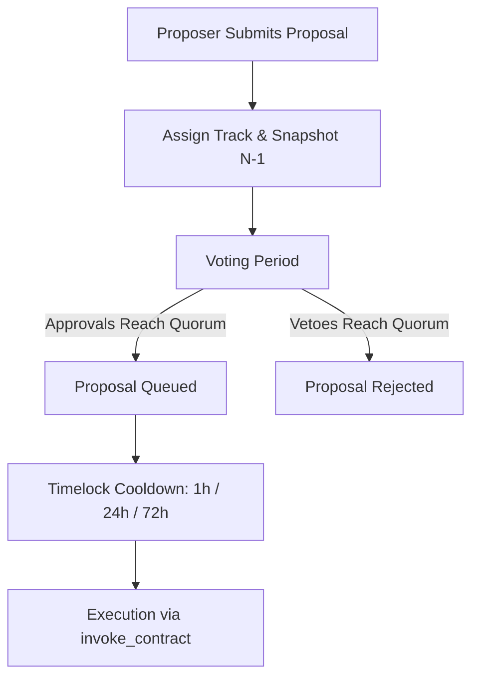

# Decentralized Timelocked Governance

## Overview

The Verdant Bond Protocol employs a **decentralized, risk-tiered, timelocked governance mechanism** for all critical protocol parameters and emergency controls. This architecture addresses centralization risks and prevents governance manipulation attacks (such as flash-loan voting) while maintaining responsive circuit breakers.

---

## 1. Multi-Track Governance Model

Governance proposals are categorized into distinct tracks based on their risk profile. Each track enforces tailored timelock delays, approval thresholds, and quorum requirements:

| Governance Track | Target Operations | Timelock Delay | Quorum / Approval Threshold |
| :--- | :--- | :--- | :--- |
| **Routine** | Minor operational parameter tuning, routine allow-list additions | 24 hours (`86,400s`) | Standard multisig threshold (e.g. 3 of 5) |
| **Critical** | Oracle staleness thresholds, credit-type registry additions, AMM price-deviation caps, dispute bond sizes, contract admin rotation | 72 hours (`259,200s`) | Elevated multisig threshold (e.g. 4 of 5) and/or token/stake weight quorum |
| **Emergency** | Protocol circuit breaker (`pause` / emergency halts during discovered vulnerabilities) | 1 hour (`3,600s`) | Supermajority council consensus (5 of 5) |

### Track Configuration

Track parameters are stored on-chain and can be updated via the governance contract:
- `set_track_config(track, timelock_seconds, threshold, min_approval_weight, nonce)`
- `get_track_config(track) -> TrackConfig`

---

## 2. Flash-Loan Resistance via Pre-Proposal Snapshot Checkpointing

Flash loans allow an attacker to borrow vast amounts of capital within a single ledger transaction, vote to pass a malicious proposal, and repay the loan in the same transaction or block.

To make flash-loan governance attacks mathematically impossible:

1. **Historical Checkpoints**: Voting power changes (e.g., token staking or reputation updates) are recorded as ordered ledger checkpoints `(ledger_sequence, vote_weight)` for each address.
2. **Strict Pre-Proposal Snapshot**: When a proposal is created at ledger sequence $N$, its snapshot sequence is strictly pinned to:
   $$\text{snapshot\_sequence} = N - 1$$
3. **Historical Evaluation**: When any voter casts an approval or veto, the contract performs a binary search over that voter's historical checkpoints at `snapshot_sequence`.
4. **Flash Loan Inefficacy**:
   - Any voting power acquired at ledger sequence $N$ (the block of proposal creation) or thereafter is completely invisible to the proposal's snapshot.
   - Attackers borrowing millions of tokens in the same or subsequent blocks receive **zero voting weight** at $N - 1$, causing malicious voting attempts to fail with `GovernanceError::InsufficientVotingPower`.

---

## 3. Emergency Pause Circuit Breaker

In the event of an active exploit or critical oracle feed failure, the protocol provides an emergency-pause path:

- **Proposal**: Created via `propose_emergency_pause(caller, target, nonce)` or `propose_with_track(..., GovernanceTrack::Emergency)`.
- **Supermajority Consensus**: Requires 100% of designated signers (5 of 5) to reach approval.
- **Short Timelock**: 1-hour delay allows automated monitoring systems and validators to verify legitimacy before execution.
- **Pause State Inspection**: Any caller or smart contract can query `is_paused(target) -> bool` to enforce paused states across the protocol.
- **Direct Emergency Pause**: Multisig signers can directly invoke `set_paused(target, is_paused)` under strict authentication.

---

## 4. Proposal Lifecycle

1. **Submission**: A council signer submits `propose_with_track(target, method, args, description, track, nonce)`. Target and method must exist in the governance allow-list.
2. **Snapshot**: Snapshot ledger is captured as `env.ledger().sequence() - 1`.
3. **Voting**: Voters submit `vote_approve(proposal_id, nonce)` or `vote_veto(proposal_id, nonce)`. Council signers contribute count, and staked voters contribute weight at snapshot.
4. **Queuing**: Upon meeting track thresholds or min approval weight, proposal moves to `Queued` state and `queued_at` timestamp is recorded.
5. **Timelock**: Proposal must wait for `timelock_seconds` to elapse before execution.
6. **Execution**: Any account can call `execute(proposal_id, nonce)`. Governance dispatches the authorized contract invocation to `target.method(args)`.
